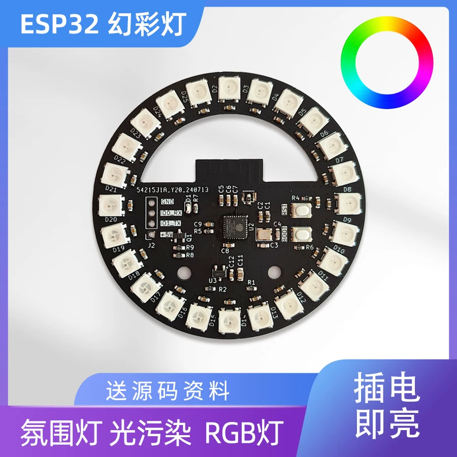

# AgentAura

智能体（AI Agent）状态可视化的多端项目，通过硬件指示灯与 IDE 插件将智能体的实时状态（运行中、忙碌、等待、错误等）映射为直观的光效与界面提示。使用开源硬件做开源插件 / 固件，希望大家能有更便宜的开源替代方案，如果有更便宜的也请联系我或给我留言。

---

## 当前已支持的设备

以下设备已由 AgentAura 项目当前支持：

- ESP32 开发板圆形幻彩灯 WS2812B 圆环灯板



---

## 插件说明

本插件的所有功能都是使用 vibe coding 开发的，纯科技、无手搓，除了插件说明这一段，没有一行是手动修改的。有 bug 是正常的，自己写 bug 可能更多，有问题请留言，我会尽量修复。

### 插件 | 设备的一些说明

- QwenPaw：由于 QwenPaw 支持 hooks，可以从官方接口直接拿到状态，功能比较完善，会优先更新。
- Claude Code：已支持，使用 Claude Code 原生插件结构和 hooks，将会话开始、用户提交、工具调用、权限等待、停止等事件同步到环形灯，并提供 `/agent-aura-claude:aura` 命令在会话内手动控制。
- VS Code Copilot：还在“打补丁”的阶段，原生没 hooks，也没有接口能拿到完整的运行状态，信息跑起来有点费劲，体验上很不稳定，建议勇士抱着实验精神凑合试用。
- Codex：已支持，采用类似 Codex 宠物的 hook 机制，将 `UserPromptSubmit`、`PreToolUse`、`PermissionRequest` 等事件同步到环形灯。
- qwen code / kimi cli / zcode 等国产工具：尽量支持，看时间和当时的 token 余额而定。
- 未来计划：希望做带屏幕、可确认交互的硬件设备，但时间还没敲定，市场好货多的时候可能就随缘。

## 子模块实现概述

- `PetDesktop`
  - 基于 Tauri 2、React 和 Rust 的 Windows/macOS/Linux 桌面宠物应用。
  - 接收多个 Agent 插件状态，按优先级仲裁后驱动 Codex 宠物 spritesheet 动画。
  - 提供 Agent 管理、宠物安装、透明桌宠、系统托盘，以及 HTTP/UDP/串口 AgentAura 硬件桥接。
  - 默认在本机提供固件兼容 API；四个现有插件在没有显式硬件目标时会优先连接 PetDesktop。

- `Agent_Plugin/agent-aura-copilot`
  - 监听 GitHub Copilot Chat 的 transcript 和 VS Code 终端事件。
  - 解析 Copilot 会话生命周期（用户消息、推理开始、工具执行、审批/确认、回复结束），并将其映射为 `running` / `busy` / `waiting` / `idle` / `error` 等状态。
  - 通过 `DeviceClient` 发送控制指令到设备，支持 HTTP / UDP / Serial 三种传输方式。

- `Agent_Plugin/agent-aura-codex`
  - 通过 Codex `~/.codex/hooks.json` 注册命令型 hook，捕获用户提交、工具执行、权限请求和停止事件。
  - 将 Codex 事件映射为固件内置状态指令，如 `agent running`、`agent busy`、`agent waiting`、`agent idle`。
  - 提供 CLI 配置、设备发现、手动测试和打包脚本，支持 HTTP / UDP / Serial 三种传输方式。

- `Agent_Plugin/agent-aura-claude`
  - 通过 Claude Code marketplace 插件和 `hooks/hooks.json` 捕获 `SessionStart`、`UserPromptSubmit`、`PreToolUse`、`PermissionRequest`、`Stop` 等生命周期事件。
  - 将 Claude Code 事件映射为固件内置状态指令，如 `agent init`、`agent running`、`agent busy`、`agent waiting`、`agent idle`、`agent error`、`agent offline`。
  - 提供 `/agent-aura-claude:aura` 会话内命令，可手动发送状态、原始固件指令、查看连接状态，以及启用/暂停状态同步。
  - 支持 Claude 插件 `userConfig` 配置和 HTTP / UDP / USB 串口三种传输方式；串口依赖随插件默认安装。

- `Agent_Plugin/qwenpaw-plugin`
  - 包装 QwenPaw 的 `AgentRunner` 与 `ApprovalService`，捕获智能体事件和审批流程。
  - 将 QwenPaw 事件转换为固件可识别的状态指令（如 `agent running`、`agent busy`、`agent waiting`、`agent error`）。
  - 通过 HTTP/UDP/串口客户端与 ESP32 设备通信，并支持设备发现与配置页面。

- `Arduino_ESP32_RingLight/ESP32_RingLight_Firmware`
  - ESP32 固件实现了 WS2812B RGB 环形灯驱动、指令解析、网络与串口通信、BLE、MQTT、Web 控制面板，以及状态映射逻辑。
  - 支持 REST API、UDP 文本指令、MQTT 事件、BLE GATT 以及 USB CDC 串口控制。
  - 内置智能体状态映射指令集，支持 `init`、`running`、`busy`、`waiting`、`idle`、`error` 等预设效果。

## 项目结构

```text
AgentAura/
├── main.py                              # Python 入口（预留）
├── pyproject.toml                       # uv 依赖管理
├── README.md                            # 本文件
├── PetDesktop/                          # 三平台桌面宠物与硬件桥接
├── Agent_Plugin/                        # IDE 插件集合
│   ├── agent-aura-copilot/              # Copilot VS Code 插件
│   ├── agent-aura-claude/               # Claude Code marketplace 插件
│   ├── agent-aura-codex/                # Codex hook 插件
│   └── qwenpaw-plugin/                  # QwenPaw 插件
├── Arduino_ESP32_RingLight/             # 硬件：ESP32 环形灯
│   ├── ESP32_RingLight_Demo/
│   └── ESP32_RingLight_Firmware/
└── docs/                               # 文档与资源
```

### 目录命名约定

- `Arduino_{MCU}_{硬件类型}/`：硬件子项目，例如 `Arduino_ESP32_RingLight` 表示基于 ESP32 的环形灯。
- `Agent_Plugin/{plugin_name}/`：IDE / Agent CLI 插件，例如 `Agent_Plugin/agent-aura-copilot`、`Agent_Plugin/agent-aura-claude`、`Agent_Plugin/qwenpaw-plugin`。

---

## 开发环境

- Python ≥ 3.13：主项目运行。
- [uv](https://docs.astral.sh/uv/) 最新版：Python 依赖与虚拟环境管理。

```bash
# 安装 uv 后同步依赖
uv sync

# 编译固件需要同步相关依赖
uv sync --group firmware
```

各子项目可能有额外的依赖与构建工具，请参阅对应目录下的 README。

---

## 许可证

本项目代码可自由用于个人学习和二次开发。
