# AgentAura 调用流程全景图

> 基于当前仓库实现整理。实线表示主调用/数据流，虚线表示发现、配置或可选路径。

```mermaid
flowchart LR
  classDef host fill:#172033,stroke:#6ea8fe,color:#fff,stroke-width:2px
  classDef plugin fill:#241b38,stroke:#b197fc,color:#fff
  classDef core fill:#12352f,stroke:#63e6be,color:#fff,stroke-width:2px
  classDef protocol fill:#382d16,stroke:#ffd43b,color:#fff
  classDef hardware fill:#3b1d22,stroke:#ff8787,color:#fff,stroke-width:2px
  classDef output fill:#17324a,stroke:#74c0fc,color:#fff
  classDef optional fill:#2b2b2b,stroke:#adb5bd,color:#eee,stroke-dasharray: 5 5

  subgraph SOURCES["Agent / IDE / App 事件源"]
    direction TB
    CODEX["Codex CLI<br/>命令型 hooks<br/>SessionStart / PreToolUse / PermissionRequest / PostToolUse / Stop"]:::host
    CLAUDE["Claude Code<br/>Marketplace 插件 + hooks.json<br/>会话 / 工具 / 审批 / 停止事件"]:::host
    KIMI["Kimi Code CLI<br/>config.toml [[hooks]]<br/>stdin JSON 生命周期事件"]:::host
    COPILOT["VS Code + GitHub Copilot Chat<br/>transcript + 终端 / 会话观察"]:::host
    QWEN["QwenPaw<br/>AgentRunner + ApprovalService<br/>查询 / 工具 / 审批事件"]:::host
    USER["用户 / 管理界面<br/>手动状态、灯效、连接配置"]:::host
  end

  subgraph PLUGINS["AgentAura 插件层：捕获 → 映射 → 去抖/冷却"]
    direction TB
    PCODEX["agent-aura-codex<br/>hooks.ts → DeviceClient"]:::plugin
    PCLAUDE["agent-aura-claude<br/>hooks.js → RingLightClient<br/>另有 /agent-aura-claude:aura"]:::plugin
    PKIMI["agent-aura-kimi-code<br/>hooks.ts → DeviceClient"]:::plugin
    PCOPILOT["agent-aura-copilot<br/>CopilotWatcher / TranscriptWatcher<br/>→ StateMapper → DeviceClient"]:::plugin
    PQWEN["qwenpaw-plugin<br/>runner.py + approval.py<br/>→ mapper.py → client.py"]:::plugin
    CANON["统一状态 / 文本命令<br/>agent init | running | busy | waiting<br/>idle | error | offline | upgrade<br/>以及 rgb / effect / brightness / speed / power / reset"]:::core
  end

  CODEX --> PCODEX
  CLAUDE --> PCLAUDE
  KIMI --> PKIMI
  COPILOT --> PCOPILOT
  QWEN --> PQWEN
  PCODEX --> CANON
  PCLAUDE --> CANON
  PKIMI --> CANON
  PCOPILOT --> CANON
  PQWEN --> CANON

  subgraph TRANSPORT["插件出站：三选一；目标可以是 PetDesktop 或 ESP32"]
    direction TB
    HTTP["HTTP<br/>状态：POST /api/agent?state=...<br/>命令：POST /api/cmd text/plain<br/>PetDesktop 127.0.0.1:47831<br/>ESP32 :80<br/>远程可用 Bearer Token"]:::protocol
    UDP["UDP 文本协议 :8888<br/>agent busy\\n 等<br/>远程鉴权：auth token command"]:::protocol
    SERIAL["USB CDC 串口<br/>文本命令 + 换行<br/>115200 baud"]:::protocol
    DISC["UDP 广播发现<br/>discover / ping / who<br/>255.255.255.255:8888<br/>设备返回 JSON（IP/HTTP端口/caps）"]:::optional
  end

  CANON --> HTTP
  CANON --> UDP
  CANON --> SERIAL
  PCODEX -. autoDiscover .-> DISC
  PCLAUDE -. autoDiscover .-> DISC
  PKIMI -. autoDiscover .-> DISC
  PCOPILOT -. 设备扫描 .-> DISC
  PQWEN -. autoDiscover .-> DISC

  subgraph DESKTOP["PetDesktop（Tauri 2 + Rust + React）"]
    direction TB
    DSERV["本地兼容服务<br/>HTTP :47831 / UDP :8888<br/>/health /api/state /api/agent /api/cmd"]:::core
    V1["多 Agent API<br/>register / heartbeat(10s) / state<br/>list / selection / delete<br/>HTTP /api/v1/agents/*"]:::core
    ARB["AppCore 状态仲裁<br/>锁定来源优先；否则按状态优先级 + 最近活跃<br/>error > waiting > upgrade > busy > running > init > idle > offline"]:::core
    SNAP["snapshot-changed 事件<br/>AppSnapshot"]:::core
    REACT["React 管理 App<br/>Agents / Pets / Hardware / Settings / Logs<br/>Tauri invoke + event listen"]:::output
    PET["透明桌宠窗口<br/>effectiveState → spritesheet 动画行<br/>闲逛 / 置顶 / 穿透"]:::output
    BRIDGE["Hardware Worker 桥接<br/>mpsc 队列；状态变化或白名单命令<br/>HTTP / UDP / Serial"]:::core
  end

  HTTP -->|"兼容状态 / 命令"| DSERV
  UDP -->|"兼容状态 / 命令"| DSERV
  HTTP -. "升级插件可注册身份" .-> V1
  DSERV --> ARB
  V1 --> ARB
  ARB --> SNAP
  SNAP --> REACT
  SNAP --> PET
  ARB -->|"effectiveState；同步未暂停"| BRIDGE
  USER -->|"Tauri invoke"| REACT
  REACT -->|"锁定 Agent / 配置硬件 / 测试命令"| ARB
  REACT --> BRIDGE

  subgraph DEVICE["ESP32 Ring Light 固件"]
    direction TB
    NET["网络 / 接口入口<br/>REST HTTP :80<br/>UDP :8888<br/>USB Serial 115200<br/>BLE GATT<br/>MQTT Broker / topic"]:::hardware
    PARSER["统一 Command Parser<br/>状态与灯控文本命令"]:::hardware
    STATE["Agent 状态映射 + Effect Engine<br/>init/running/busy/waiting/idle/error/offline/upgrade<br/>→ 对应颜色、呼吸、跑马、闪烁等"]:::hardware
    LED["LED Driver<br/>FastLED → WS2812B 圆环"]:::hardware
    WEB["固件 Web 控制页 / Wi-Fi AP 配网页<br/>浏览器 → HTTP API"]:::output
    MQTT["外部 MQTT 客户端 / 自动化平台"]:::optional
    BLEAPP["BLE App / GATT Client"]:::optional
  end

  HTTP -->|"插件直连路线"| NET
  UDP -->|"插件直连路线"| NET
  SERIAL -->|"插件直连路线"| NET
  BRIDGE -->|"HTTP :80 / UDP :8888 / Serial 115200"| NET
  DISC -. "发现响应" .-> DSERV
  DISC -. "发现响应" .-> NET
  WEB --> NET
  MQTT -. "MQTT 消息" .-> NET
  BLEAPP -. "BLE GATT" .-> NET
  NET --> PARSER
  PARSER --> STATE
  STATE --> LED
  LED --> RING["物理输出<br/>ESP32 + WS2812B 环形灯"]:::output

  NOTE["两条有效主链路<br/>A. Agent → 插件 → ESP32（直连）<br/>B. Agent → 插件 → PetDesktop 仲裁/桌宠 → ESP32（桥接）"]:::optional
  NOTE -.-> CANON
```

## 调用方式速查

| 发起方 | 接收方 | 调用方式 | 主要载荷 / 用途 |
|---|---|---|---|
| Codex / Claude / Kimi 插件 | PetDesktop 或 ESP32 | HTTP、UDP、USB Serial | `agent <state>`、灯控文本命令 |
| Copilot VS Code 扩展 | PetDesktop 或 ESP32 | HTTP、UDP、USB Serial | transcript/终端事件映射后的状态 |
| QwenPaw 插件 | PetDesktop 或 ESP32 | HTTP、UDP、USB Serial | AgentRunner/ApprovalService 事件映射后的状态 |
| 各插件 | PetDesktop / ESP32 | UDP 广播 `:8888` | `discover`，返回设备 JSON；随后通常切为 HTTP |
| 升级后的 Agent 插件 | PetDesktop | HTTP `/api/v1/agents/*` | 注册实例、10 秒心跳、独立状态、断开 |
| PetDesktop React UI | Rust 后端 | Tauri `invoke` + `snapshot-changed` | 配置、Agent 锁定、宠物/硬件管理、实时快照 |
| PetDesktop | ESP32 | HTTP `:80` / UDP `:8888` / Serial `115200` | 仲裁后的有效状态与白名单灯控命令 |
| Web / MQTT / BLE 客户端 | ESP32 | HTTP / MQTT / BLE GATT | 配网、手动控制、自动化控制 |
| ESP32 命令解析器 | Effect Engine / LED Driver | 固件内部函数调用 | 状态 → 灯效 → FastLED → WS2812B |

## 阅读要点

- 插件不会同时使用三种传输；每个插件按配置选择 HTTP、UDP 或 Serial。
- PetDesktop 是可选中间层。插件直连 ESP32 时没有多 Agent 仲裁和桌宠联动；连接 PetDesktop 时，状态会先仲裁，再驱动桌宠，并可继续桥接到 ESP32。
- PetDesktop 的 `/api/agent` 是兼容入口；`/api/v1/agents/*` 才能保留多个 Agent 实例身份、心跳和选择信息。
- `rgb/effect/brightness/speed/power/reset` 在 PetDesktop 中是硬件透传白名单；`agent <state>` 在本地更新状态后，按配置同步给硬件。
- ESP32 还提供 MQTT、BLE 与固件 Web 控制页，这几条路径不经过 Agent 插件。
