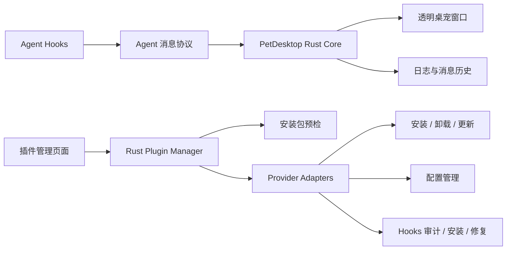

# PetDesktop 桌宠气泡与插件管理开发计划

## 1. 文档状态

- 状态：已确认，待实施
- 目标版本：后续 PetDesktop 功能版本
- 适用平台：Windows、Linux、macOS
- 涉及模块：`PetDesktop`、AgentAura 各 Agent 插件、构建与发布脚本

## 2. 背景与结论

本计划包含两项相互关联的能力：

1. 在桌宠上方显示文字气泡，展示状态提示和 Agent Hook 事件摘要。
2. 在 PetDesktop 管理窗口新增“插件”页面，从本地安装包安装、检测、配置和维护 AgentAura 插件及 Hooks。

Codex App 宠物的内部文字实现没有公开扩展接口，因此本项目不依赖 Codex 内部 API，而是在 PetDesktop 现有透明 Tauri 窗口、React 渲染层和 Agent 状态协议之上独立实现相同类型的视觉体验。

第一版明确支持：

- 状态模板文字，例如“正在运行工具”“等待授权”“任务完成”。
- 插件能从 Hook 事件中提取到的工具名称、错误摘要和阶段信息。
- 多 Agent 来源切换、消息优先级、超时消失和隐私控制。

第一版不承诺：

- 获取 Codex App 内部宠物消息。
- 捕获所有 Agent 的完整流式回复正文。
- 执行来源不明的任意安装脚本或 Shell 命令。
- 自动从互联网下载插件包。

## 3. 已确认产品决策

### 3.1 文字气泡

- 默认展示“状态模板 + Hook 事件摘要”。
- 默认只显示纯文本，不解析 Markdown 或 HTML。
- 默认截断长文本，完整内容可在管理页日志中查看。
- 用户可关闭气泡、仅显示状态、仅显示事件摘要或同时显示。

### 3.2 插件安装来源

- 用户手动选择本地插件安装包。
- 支持从资源管理器或 Finder 拖拽一个或多个文件。
- 不依赖固定的 `dist/plugin` 路径；该目录仅可作为文件选择器的默认建议位置。
- 拖入文件后先预检和展示安装计划，用户确认后才执行。

### 3.3 首批支持插件

- AgentAura Claude
- AgentAura Codex
- AgentAura Copilot
- AgentAura Kimi Code
- AgentAura Qwen Code
- AgentAura QwenPaw

## 4. 当前架构基础

PetDesktop 当前已具备：

- React 管理窗口和独立宠物窗口。
- 透明、置顶、可点击穿透的 Tauri Webview 窗口。
- 宠物缩放、拖动、闲逛和多显示器位置管理。
- Rust 后端、Tauri Commands、本地 HTTP Agent API。
- Agent 注册、心跳、状态选择和运行日志。
- 多页管理 UI，可直接增加“插件”导航项。

新增能力应沿用现有分层，不把安装命令、配置文件解析或 Hooks 修改逻辑放进 React 层。



## 5. 功能 A：桌宠文字气泡

### 5.1 数据模型

Rust 和 TypeScript 使用语义一致的数据结构：

```ts
type PetMessageKind = 'state' | 'activity' | 'success' | 'warning' | 'error';

interface PetMessage {
  id: string;
  agentInstanceId?: string;
  kind: PetMessageKind;
  text: string;
  source: string;
  priority: number;
  createdAt: string;
  ttlMs: number;
}
```

约束：

- 接收文本最大 500 个 Unicode 字符。
- 气泡默认显示最多 140 个字符。
- 禁止 HTML；React 必须以普通文本节点渲染。
- `ttlMs` 限制在 1.5 秒至 30 秒之间。
- 错误和等待消息优先级高于普通活动消息。

### 5.2 设置项

在 `AppSettings` 增加：

```ts
interface PetBubbleSettings {
  enabled: boolean;
  mode: 'state' | 'events' | 'both';
  durationSeconds: number;
  maxCharacters: number;
  fontScale: number;
  showSource: boolean;
}
```

默认值：

- `enabled: true`
- `mode: 'both'`
- `durationSeconds: 5`
- `maxCharacters: 140`
- `fontScale: 1`
- `showSource: false`

### 5.3 状态模板

没有事件摘要时，按状态提供本地化模板：

| 状态 | 默认文字 |
|---|---|
| `init` | 正在初始化… |
| `running` | 正在处理任务… |
| `busy` | 正在使用工具… |
| `waiting` | 等待你的确认 |
| `error` | 操作出现错误 |
| `idle` | 任务已完成 |
| `offline` | Agent 已离线 |
| `upgrade` | 正在更新… |

连续相同状态不重复入队；短时间内的状态变化使用去抖规则。

### 5.4 消息队列

- 每个 Agent 保留最多 20 条内存消息。
- 桌宠只显示当前有效 Agent 的消息。
- 高优先级消息可以替换低优先级消息。
- 同内容在短时间内去重。
- Agent 切换时清理已过期消息，并立即显示新 Agent 最近的有效消息。
- 历史消息仅进入运行日志，第一版不持久化完整正文。

### 5.5 Agent 消息协议

新增向后兼容接口：

```text
POST /api/v1/agents/{instance_id}/message
```

请求体：

```json
{
  "kind": "activity",
  "text": "正在运行 cargo test",
  "priority": 20,
  "ttlMs": 5000
}
```

处理规则：

- 必须复用现有 Agent 身份、来源限制和认证逻辑。
- 未注册 Agent 返回明确错误。
- LAN 模式继续遵守现有 Token 验证。
- 旧插件不发送消息时继续正常工作，仅展示状态模板。

### 5.6 插件事件摘要

各插件只发送 Hook 已提供的信息，不读取用户文件或完整对话：

- 工具开始：`正在运行 <tool>`
- 工具完成：`<tool> 已完成`
- 权限请求：`<tool> 等待授权`
- 工具失败：发送经过截断和清理的错误摘要
- 会话结束：`任务已完成`

如果 Hook 不提供工具名称，只发送通用状态模板。

### 5.7 宠物窗口 UI

在 `Pet.tsx` 增加：

- `PetBubble` 组件。
- 消息进入/退出动画。
- 文本换行、最大宽度和箭头样式。
- `aria-live="polite"`，但避免高频状态刷屏。

窗口行为：

- 宽度由当前 220 调整为可容纳气泡的逻辑宽度，建议上限 360。
- 高度按气泡内容动态计算。
- 调整窗口尺寸时保持宠物脚底屏幕坐标不变，避免气泡出现时宠物跳动。
- 每次缩放后调用现有 monitor clamp 逻辑，避免气泡超出屏幕。
- 点击穿透开启时，气泡与宠物整体穿透。
- 右键菜单打开时暂停气泡自动消失计时。

### 5.8 气泡验收标准

- 无消息时不影响现有宠物布局和动画。
- 状态变化后 200ms 内显示对应文字。
- 气泡不会被透明窗口裁切。
- 改变气泡高度时宠物脚底位置不移动。
- 多显示器、125%/150%/200% DPI 下位置正确。
- 关闭气泡后不再调整窗口尺寸。
- 文本无法注入 HTML 或脚本。

## 6. 功能 B：插件管理页面

### 6.1 页面结构

在管理窗口导航中新增“插件”页面，包含：

1. 顶部环境检查区域。
2. 安装包拖拽区和“选择文件”按钮。
3. 待安装包预检列表。
4. 已支持插件状态卡片。
5. 插件配置编辑器。
6. Hooks 状态、安装、卸载和修复操作。
7. 操作进度、实时日志和错误详情。

### 6.2 文件选择与拖拽

支持：

- Tauri 文件选择器多选。
- 系统文件拖拽事件。
- 一次拖入多个包。
- 重复文件去重。
- 拖入目录时明确拒绝；后续版本可单独支持开发目录。

UI 状态：

- 空闲：显示支持格式。
- 拖入悬停：高亮投放区域。
- 检查中：显示文件名和扫描进度。
- 可安装：显示识别出的插件、版本和操作。
- 缺少配套包：提示继续选择文件。
- 不支持或损坏：展示原因，不允许安装。

### 6.3 支持包格式

| Provider | 包格式 | 备注 |
|---|---|---|
| Claude | `.tgz` / `.zip` | 识别 Claude 插件清单和 npm 清单 |
| Codex | `.tgz` | 安装 CLI 后管理 Codex Hooks |
| Copilot | `.vsix` | 调用 VS Code CLI 安装 |
| Kimi Code | `.tgz` | 安装 CLI 后管理 Kimi Hooks |
| Qwen Code | `.tgz` + `.zip` | CLI 与 Qwen 扩展可组合安装 |
| QwenPaw | `.zip` | 调用 QwenPaw 插件安装命令 |

### 6.4 安装包预检

拖入文件后必须完成以下检查：

- 文件存在且是普通文件。
- 扩展名在允许列表中。
- 验证 ZIP、TGZ、VSIX 文件头。
- 限制包大小，默认 200MB。
- 限制压缩包条目数量，默认 10,000。
- 拒绝绝对路径、`..`、盘符路径和符号链接逃逸。
- 读取并校验 `package.json`、`plugin.json`、`qwen-extension.json` 或 VSIX manifest。
- 验证插件 ID、名称、版本和 Provider 是否匹配允许列表。
- 计算 SHA-256，并在确认页面显示。
- 不在预检阶段执行包内脚本。

预检结果模型：

```ts
interface PluginPackageInspection {
  path: string;
  sha256: string;
  format: 'tgz' | 'zip' | 'vsix';
  provider: PluginProvider;
  packageRole: 'cli' | 'extension' | 'plugin';
  id: string;
  version: string;
  displayName: string;
  warnings: string[];
  valid: boolean;
}
```

### 6.5 Qwen Code 包配对

Qwen Code 同时支持 CLI `.tgz` 和扩展 `.zip`：

- 一次拖入两个文件时自动按 Provider 和版本配对。
- 只选择一个文件时允许单独安装，但明确提示缺少另一部分。
- 版本不一致时显示警告并要求二次确认。
- Hooks 管理由 CLI 包提供；Qwen 扩展安装与 Hooks 安装是两个独立步骤。

### 6.6 插件状态模型

```ts
type PluginProvider =
  | 'claude'
  | 'codex'
  | 'copilot'
  | 'kimi-code'
  | 'qwencode'
  | 'qwenpaw';

interface ManagedPluginStatus {
  provider: PluginProvider;
  installed: boolean;
  version?: string;
  executableAvailable: boolean;
  hooks: 'unsupported' | 'missing' | 'installed' | 'invalid';
  configPath?: string;
  hookPath?: string;
  lastError?: string;
}
```

### 6.7 Rust 插件管理器

新增建议模块：

```text
PetDesktop/src-tauri/src/plugins/
├── mod.rs
├── model.rs
├── inspect.rs
├── process.rs
├── backup.rs
├── claude.rs
├── codex.rs
├── copilot.rs
├── kimi.rs
├── qwencode.rs
└── qwenpaw.rs
```

职责：

- 安装包识别和安全预检。
- 环境与可执行文件检测。
- Provider 安装、卸载和版本检查。
- 配置读取、验证和保存。
- Hooks 检测、安装、卸载和修复。
- 子进程输出采集、取消和超时。
- 修改前备份和失败回滚。

### 6.8 进程执行安全

- 只允许执行 Provider Adapter 中声明的程序。
- 使用 `std::process::Command` / Tokio Command 的参数数组，不拼接 Shell 字符串。
- 不执行包内任意脚本路径。
- 安装命令必须显示在确认页，但敏感 Token 需脱敏。
- 默认不自动提权。
- 需要管理员权限时停止操作并提示用户，不自动调用 `sudo` 或 UAC。
- 子进程默认超时 5 分钟，可取消。
- 标准输出和错误输出流式发送到 UI。

### 6.9 安装位置策略

Node CLI 插件优先安装到 PetDesktop 管理的用户级目录，避免全局 npm 权限问题：

```text
<appData>/managed-plugins/node/
```

Hooks 指向该稳定目录中的实际可执行入口。升级采用新目录安装成功后切换，失败则保留旧版本。

不适用托管目录的 Provider：

- Copilot：通过 `code --install-extension <vsix>`。
- Qwen Code 扩展：通过 `qwen extensions install <zip>`。
- QwenPaw：通过 `qwenpaw plugin install <zip>`。
- Claude：先探测当前 Claude CLI 是否支持非交互插件管理；不支持时生成明确的手动命令和状态检查，不假装安装成功。

### 6.10 Provider Adapter 操作矩阵

| Provider | 检测 | 安装 | 卸载 | 配置 | Hooks |
|---|---:|---:|---:|---:|---:|
| Claude | 是 | 自动或引导 | 自动或引导 | 是 | 插件自带 |
| Codex | 是 | 是 | 是 | 是 | 安装/卸载/修复 |
| Copilot | 是 | 是 | 是 | VS Code 设置引导 | 不适用 |
| Kimi Code | 是 | 是 | 是 | 是 | 安装/卸载/修复 |
| Qwen Code | 是 | 是 | 是 | 是 | 安装/卸载/修复 |
| QwenPaw | 是 | 是 | 是 | Provider 配置 | 插件自带 |

### 6.11 配置管理

- 表单字段来自 PetDesktop 内置 Provider Schema，不信任包内任意 UI Schema。
- 支持连接方式、Host、Port、串口、波特率、Token、启用状态等公共字段。
- 密钥字段默认隐藏，日志中脱敏。
- 保存前校验端口、路径、枚举和数值范围。
- 使用临时文件 + 原子替换写配置。
- 写入前创建带时间戳的备份。

### 6.12 Hooks 管理

每个 Adapter 必须做到：

- 只识别 AgentAura 自己的标记块、名称前缀或结构。
- 安装时保留用户和其它插件的 Hooks。
- 卸载时只删除 AgentAura 管理项。
- 修复前展示差异。
- 修改前备份原文件。
- 写入后重新解析并验证。
- 提供“打开配置所在目录”和“复制诊断信息”。

### 6.13 Tauri Commands

建议新增：

```text
inspect_plugin_packages(paths)
list_managed_plugins()
install_plugin(plan)
cancel_plugin_operation(operation_id)
uninstall_plugin(provider)
load_plugin_config(provider)
save_plugin_config(provider, config)
inspect_plugin_hooks(provider)
install_plugin_hooks(provider)
remove_plugin_hooks(provider)
repair_plugin_hooks(provider)
```

长操作通过事件推送：

```text
plugin-operation-progress
plugin-operation-log
plugin-operation-complete
```

### 6.14 插件页验收标准

- 可通过按钮选择一个或多个安装包。
- 可从资源管理器/Finder 拖入安装包。
- 未确认前不执行安装。
- 损坏包、未知包和路径逃逸包会被拒绝。
- Qwen Code 双包可自动配对。
- 安装日志实时可见，操作可取消。
- 配置和 Hooks 修改前有备份。
- 失败后状态与实际系统一致，不显示假成功。
- 重启 PetDesktop 后仍能检测已安装插件。

## 7. UI 设计草案

```text
插件
├── 环境检查
│   ├── Node / npm
│   ├── Claude / Codex / Kimi / Qwen / QwenPaw CLI
│   └── VS Code CLI
├── 安装包投放区
│   ├── 拖拽文件到这里
│   └── 选择文件
├── 待安装列表
│   ├── Provider / 版本 / SHA-256
│   ├── 警告与缺失配套包
│   └── 安装计划确认
├── 已安装插件
│   ├── 状态 / 版本
│   ├── 配置
│   ├── Hooks
│   └── 卸载 / 修复
└── 操作日志
```

## 8. 实施阶段

### 阶段 0：契约与测试基线

- 固化现有 PetDesktop 快照、设置、Agent API 和插件行为测试。
- 为新数据模型建立 Rust/TypeScript 对照定义。
- 建立恶意压缩包和损坏包测试夹具。

交付物：接口设计、测试夹具、回归基线。

### 阶段 1：文字气泡最小闭环

- 增加气泡设置和状态模板。
- 实现 `PetBubble`、消息队列和窗口动态尺寸。
- 完成 DPI、多显示器、点击穿透和位置锚定测试。

交付物：不依赖插件更新即可工作的状态气泡。

### 阶段 2：Agent 消息协议

- 增加消息 API、Core 队列和 Tauri 事件。
- 增加鉴权、限长、去重和日志脱敏。
- 更新一款插件作为协议样板，建议先 Codex。

交付物：Codex Hook 摘要可显示在桌宠气泡。

### 阶段 3：安装包预检与拖拽 UI

- 实现文件选择和系统拖拽。
- 实现 ZIP/TGZ/VSIX 安全读取。
- 实现 Provider、版本和角色识别。
- 实现待安装列表和确认对话框。

交付物：可安全识别全部支持包，但暂不执行安装。

### 阶段 4：插件管理后端

- 实现进程执行、日志流、取消、超时、备份和回滚框架。
- 完成用户级 Node 插件托管目录。
- 实现插件状态扫描。

交付物：统一 Plugin Manager 基础设施。

### 阶段 5：Provider 接入

建议顺序：

1. Codex
2. Kimi Code
3. Qwen Code
4. Copilot
5. QwenPaw
6. Claude

每接入一个 Provider，都必须完成检测、安装、卸载、配置、Hooks 和失败回滚测试后再进入下一个。

交付物：六款插件进入统一管理页。

### 阶段 6：其余插件消息摘要

- 将消息协议接入 Claude、Kimi、Qwen Code 和可提供事件信息的其它插件。
- Provider 不支持详细事件时使用状态模板。

交付物：跨 Agent 一致的气泡体验。

### 阶段 7：发布验收

- Windows 全量端到端测试。
- Linux/macOS 安装命令和配置路径测试。
- 回归桌宠动画、硬件同步、Agent 多实例和打包流程。
- 更新 README、API 文档、故障排查和隐私说明。

交付物：可发布版本和完整文档。

## 9. 测试计划

### 9.1 前端测试

- 气泡队列、优先级、去重和超时。
- 拖拽状态机和多文件配对。
- 安装预览、错误展示和取消操作。
- 配置表单校验和敏感字段遮罩。

### 9.2 Rust 单元测试

- 各格式 Manifest 识别。
- Zip Slip、绝对路径、符号链接和超限包拒绝。
- Provider 检测和版本解析。
- 配置原子写入、备份和恢复。
- Hooks 合并和精确卸载。
- 子进程超时、取消和错误码处理。

### 9.3 集成测试

- 从本地包完成安装、检测、配置、Hooks 安装和卸载闭环。
- 旧版本升级到新版本。
- 安装失败后保留旧版本。
- 缺少外部 CLI 时提供可执行诊断。
- Qwen Code 单包、双包和版本不一致场景。
- PetDesktop 重启后的状态恢复。

### 9.4 平台测试

| 场景 | Windows | Linux | macOS |
|---|---:|---:|---:|
| 文件选择与拖拽 | 必测 | 必测 | 必测 |
| Node 用户级安装 | 必测 | 必测 | 必测 |
| Copilot VSIX | 必测 | 建议 | 建议 |
| Hooks 路径 | 必测 | 必测 | 必测 |
| 气泡 DPI/多屏 | 必测 | 必测 | 必测 |
| 权限失败提示 | 必测 | 必测 | 必测 |

## 10. 风险与缓解

### 10.1 Agent 无完整文本事件

风险：Hook 只提供生命周期状态，没有完整回复正文。

缓解：状态模板作为稳定基线；仅展示插件实际获得的事件摘要，不抓取内部数据库或日志文件。

### 10.2 Provider CLI 差异

风险：不同版本 CLI 的安装命令和输出格式变化。

缓解：Adapter 先做能力探测；命令失败时保留原始日志；无法自动化时降级为引导模式。

### 10.3 全局安装权限

风险：`npm install -g` 在 Linux/macOS 需要额外权限。

缓解：默认使用 PetDesktop 用户级托管目录，不自动使用 sudo。

### 10.4 Hooks 损坏用户配置

风险：错误合并可能破坏已有配置。

缓解：Provider 专用解析器、修改前备份、原子写入、写后解析验证和精确标记删除。

### 10.5 不可信安装包

风险：压缩包路径逃逸、超大解压、伪造 Manifest 或恶意安装脚本。

缓解：限制格式和 Provider、流式预检、路径规范化、大小/数量限制、禁止预检执行、固定命令适配器。

## 11. 预计修改文件

PetDesktop 前端：

```text
PetDesktop/src/App.tsx
PetDesktop/src/Pet.tsx
PetDesktop/src/api.ts
PetDesktop/src/types.ts
PetDesktop/src/styles.css
```

PetDesktop Rust：

```text
PetDesktop/src-tauri/src/lib.rs
PetDesktop/src-tauri/src/model.rs
PetDesktop/src-tauri/src/core.rs
PetDesktop/src-tauri/src/server.rs
PetDesktop/src-tauri/src/plugins/*
```

插件：

```text
Agent_Plugin/agent-aura-codex/src/*
Agent_Plugin/agent-aura-claude/src/*
Agent_Plugin/agent-aura-kimi-code/src/*
Agent_Plugin/agent-aura-qwencode/src/*
```

测试与文档：

```text
PetDesktop/src/*.test.ts(x)
PetDesktop/src-tauri/src/**/*_tests.rs
PetDesktop/API.md
PetDesktop/README.md
各插件 README.md
```

## 12. 完成定义

全部满足以下条件才视为完成：

- 桌宠气泡可关闭、可配置，并在三平台正常显示。
- 状态模板和至少四款 Hook 插件的事件摘要可工作。
- 六款插件都能在管理页准确检测状态。
- 支持选择和拖拽安装包，未知或恶意包不会执行。
- Codex、Kimi、Qwen Code 的 Hooks 可安全安装、卸载和修复。
- 所有配置修改可备份和恢复。
- 安装失败不会破坏现有可用版本。
- 原有桌宠动画、硬件同步、多 Agent 和打包测试全部通过。
- Windows、Linux、macOS 验收矩阵完成。
- 用户文档、API 文档和故障排查文档同步更新。
